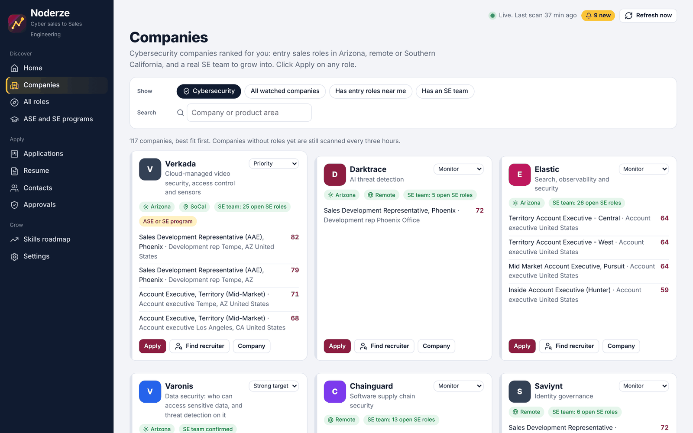
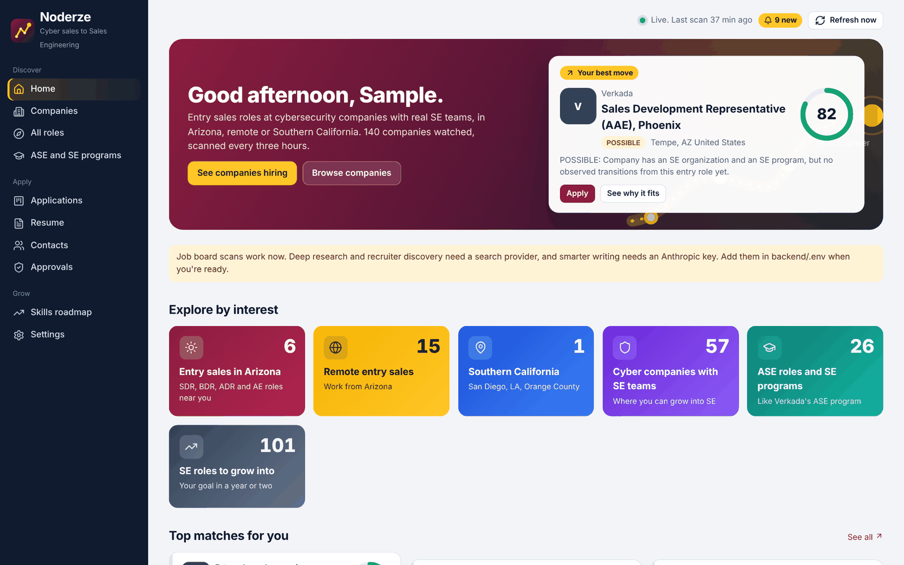
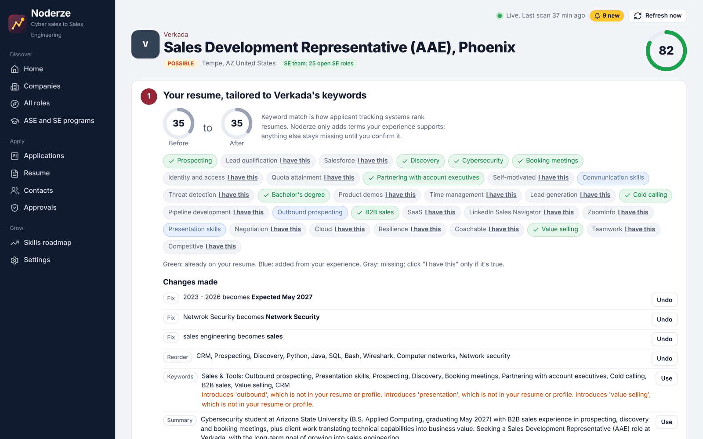
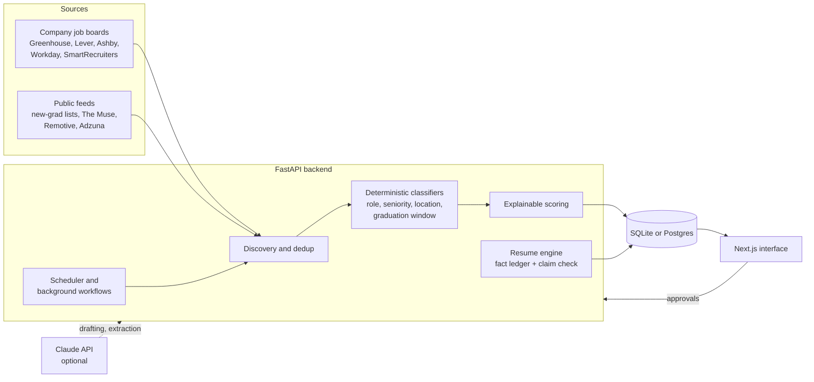

# Noderze

**A local-first job search agent for breaking into Sales Engineering through cybersecurity sales.**

Noderze finds entry-level sales roles (SDR, BDR, ADR, associate AE) at cybersecurity companies that have a real Sales Engineering team to grow into. It ranks each role with a score where every point has a written reason. It also tailors my resume to each company's keywords without inventing experience, and drafts recruiter outreach. Nothing is submitted or sent without my approval.



## Why I built it

I'm an Applied Computing (Cybersecurity) student at Arizona State University, graduating in May 2027, and my goal is Sales Engineering. A common way in is to start in sales development at a security company and move onto its SE team. Job boards can't filter for that. They don't know which companies have an SE team, which "Account Executive" postings actually want five years of closing experience, or which "remote" roles are limited to one state. Noderze answers those questions for every posting and shows its reasoning.

I wrote the product spec (requirements, scoring rules and guardrails) and built it with Claude Code as my AI pair programmer.

## What it does

- **Finds roles where they're posted first.** It reads companies' own job boards through their public APIs (Greenhouse, Lever, Ashby, SmartRecruiters, Workday, Jobvite, Amazon), plus a directory of 2,647 boards and public new-grad feeds. LinkedIn, Indeed, Glassdoor and Handshake are never scraped.
- **Ranks companies, not just postings.** It favors cybersecurity companies with entry sales roles in Arizona, remote US or Southern California. It also counts each company's open SE roles live from its own job board, as evidence of an SE team.
- **Explainable scoring.** Eight weighted components (career path, technical fit, geography, eligibility and more) add up to the score, and each comes with its reasons. Career paths are labeled DIRECT, LIKELY, POSSIBLE or WEAK based on sourced evidence.
- **Reads postings the way a recruiter would.**
  - Senior titles (enterprise, strategic, named-account) are recognized, and so are foreign postings.
  - "Remote - Tennessee" is treated as a state limit, not remote US.
  - Graduation and start-date language is parsed into an apply window.
- **Tailors the resume without fabricating.**
  - The original .docx is parsed into a fact ledger, and every suggested edit is checked against it.
  - Flagged edits are never pre-approved.
  - A missing keyword stays missing until I confirm I really have that skill.
  - Edits are applied to the original file, so formatting survives.
- **Recruiter outreach, done by hand.** It drafts messages and gives one-click LinkedIn searches to open myself. LinkedIn is never automated.
- **Live updates.** Watched companies are rescanned on a schedule, and open pages refresh when new roles arrive.
- **Runs like a desktop app on Windows.** There are no terminal windows. When the code changes, the interface rebuilds in the background and swaps in, rolling back if the build fails.

| Home | One-click apply |
|---|---|
|  |  |

*Screenshots use a sample profile and a fictional resume, with real public job postings.*

## How it works



- **Deterministic first.** Classifiers and scoring are plain, unit-tested Python, so the same posting always gets the same score. Claude is optional and is only used for drafting, fact extraction and rewriting within facts the resume already has.
- **Sourced facts.** Every company fact is stored with its URL, source type (official, employee-reported, third-party, inferred) and confidence.
- **Human in the loop.** Applications, messages and claim changes go through an approval queue. The optional browser runner (Playwright) pauses for logins and CAPTCHAs and never bypasses them.

More detail is in [docs/ARCHITECTURE.md](docs/ARCHITECTURE.md).

## Engineering notes

A few problems that came up and how they were solved:

- **"Database is locked" under concurrent scans.** Fixed with SQLite WAL mode and a busy timeout, commits after each posting, and single-flight workflows. Scans left running by a restart are cleaned up at startup.
- **Updating a running app safely.** The UI is fingerprinted from its source. When the source changes, it builds into a staging folder while the old version keeps serving, then swaps in. A failed build leaves the running version untouched and shows a notice.
- **Rescoring speed.** A full rescore of 1,864 postings went from about two minutes to about 21 seconds. The keyword matcher now runs one shared boundary check per position instead of one per term, with a small cache. The scores came out identical on every posting before and after.
- **Privacy by design.** My real profile, company notes, resume and database live in gitignored files. The repo ships a sample profile, and the tests generate a fictional resume.

## Tech stack

Python 3.11+, FastAPI, SQLAlchemy 2, SQLite or Postgres, APScheduler, python-docx, Playwright · Next.js 15, React 19, TypeScript · Anthropic API (optional) · pytest

## Run it locally

You need Python 3.11+ and Node.js 20+.

```bash
# Backend
cd backend
python -m venv .venv && source .venv/bin/activate   # Windows: .venv\Scripts\Activate.ps1
pip install -r requirements.txt
cp .env.example .env                                  # set AGENT_TOKEN to any long random string
python scripts/seed_db.py                             # loads 140 researched companies and a sample profile
uvicorn app.main:app --host 127.0.0.1 --port 8000

# Frontend (second terminal)
cd frontend
cp .env.local.example .env.local                      # paste the same AGENT_TOKEN
npm install && npm run dev                            # open http://localhost:3000
```

To make it yours, copy `backend/seed/profile.example.json` to `backend/seed/profile.json` and upload your resume on the Resume page. The [user guide](docs/USER_GUIDE.md) covers the Windows app, scheduled scans and troubleshooting.

```bash
cd backend && pytest -q    # 41 tests
```

## Project layout

```
backend/    FastAPI app: discovery, classifiers, scoring, resume engine, workflows, tests
frontend/   Next.js interface
noderze/    Windows app layer: windowless launcher, setup, icon
docs/       Architecture, user guide, screenshots
```
