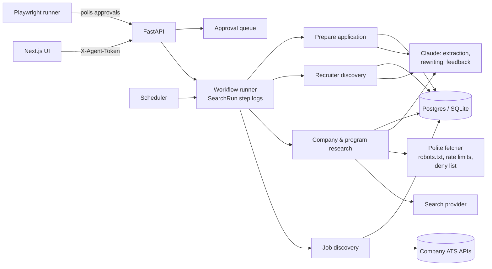

# SE Career Agent: architecture and MVP design

This document covers the ten design deliverables from the brief: stack, system architecture, schema, agent workflows, research strategy, scoring, UI, browser automation, security, and roadmap. It ends with the assumptions made along the way.

## 1. Tech stack

| Layer | Choice | Why |
|---|---|---|
| Frontend | Next.js 15 (App Router), React 19, TypeScript | As requested. Client components talk to the API; no server-side secrets in the UI. |
| Backend | Python 3.11+, FastAPI, SQLAlchemy 2 | Fast to iterate, typed, and the research/NLP ecosystem is Python. |
| Database | PostgreSQL (docker compose) or SQLite (zero setup) | Same models run on both. SQLite is the default so the app works on first run. |
| AI | Claude via the Anthropic Messages API | Structured extraction uses forced tool calls with JSON schemas, so outputs are parsed, not scraped from prose. |
| Search | Anthropic web search tool by default; Tavily, Brave or Serper as alternatives | One API key can power both reasoning and search. Providers are swappable. |
| Job data | Companies' own ATS APIs: Greenhouse, Lever, Ashby, SmartRecruiters, Workday, Amazon | Original postings first, verified on every scan. Aggregators are only leads. |
| Automation | Playwright, visible browser, persistent local profile | Behaves like an assistant at your keyboard, pauses for humans. |
| Scheduling | APScheduler inside the API process | Enough for one user. Swap for a worker queue if this ever becomes multi-user. |
| Documents | python-docx, editing the original resume in place | Your formatting survives every tailored version. |
| Auth | Local token header, bound to 127.0.0.1 | Single-user MVP. See section 9 for the multi-user path. |

Deviation from the brief: no Celery or Redis. A single-user tool does not need a separate worker fleet, and every moving part removed is one less thing to break before an application deadline.

## 2. System architecture

Module map (brief section 45 to code):

| Module | Code |
|---|---|
| User profile | `services/profile.py`, `seed/profile.json` |
| Job discovery | `services/discovery.py`, `services/ats.py` |
| Company and program intelligence | `services/research.py`, `services/evidence.py` |
| Opportunity scoring | `services/scoring.py`, `services/classify.py`, `services/jobs_engine.py` |
| Resume tailoring | `services/resume.py` |
| Application preparation | `services/prep.py`, `services/writing.py` |
| Recruiter discovery and outreach | `services/recruiters.py`, `services/writing.py` |
| Career path analysis | `services/careerpath.py` |
| Browser automation | `automation/runner.py` |
| Tracker, alerts, approvals | `routers/apply.py`, `workflows.py`, `scheduler.py`, `services/approvals.py` |
| Interview prep | `services/writing.py` (question bank), `/applications/{id}/mock` |
| Skill gap and learning | `services/skills_gap.py`, `seed/learning.json` |
| Daily actions and next moves | `services/actions.py` |
| Similar companies | `services/similar.py` |

## 3. Database schema

All tables are in `backend/app/models.py`. The rule that shapes everything: research facts live in `evidence`, never as loose columns, so every number in the UI has a source, a source type and a confidence.

| Table | Purpose and key fields |
|---|---|
| `profiles` | Structured profile JSON and scoring weights. |
| `companies` | Category, AZ/CA presence, remote policy, ATS type/token, watch status (priority, strong, monitor, edge, not relevant). |
| `programs` | Academies and early-career tracks: target family (se, ae, mixed), status, typical open window. |
| `jobs` | One row per posting, deduplicated by fingerprint (posting id, else URL, else company + title). Stores parsed location, remote scope, pay, years of experience, graduation status, score breakdown, path class, category, discovered / verified / posted dates, and an active flag. |
| `sources` | URL, title, publisher, source type, retrieval time. |
| `evidence` | Subject (company, program, job), field (for example `program.duration`), value, source, source type, confidence, observed date, note. |
| `people` | Recruiters, managers, SEs, alumni. Only from search results that point at a public profile and mention the company; unverified until you confirm. |
| `career_paths` | Role sequences from profiles you paste, with entry family, whether SE was reached, months to SE. |
| `resumes`, `resume_versions` | Master resume (parsed + fact ledger + checks) and tailored versions with per-edit approval state and claim-check flags. |
| `generated_docs` | Cover letters, answers, interview prep, study guides, with style and claim flags. |
| `applications`, `application_events`, `interview_stages` | Kanban stages, dates, versions used, readiness, package, and the outcome history used by the feedback loop. |
| `outreach` | Message, reason, status, approval, sent date, reply, follow-up date. Blocks duplicate first messages. |
| `approvals` | Every external or high-impact action and its decision. |
| `search_runs` | Every workflow run with its step log, an audit trail. |
| `alert_rules`, `alerts` | Cron-scheduled scans and the new matches they found. |
| `learning_resources` | Curated resources, each with a reason it helps an SE. |

Skills live in the profile JSON rather than a separate table; the taxonomy in `services/taxonomy.py` gives them structure. A normalized skills table is on the roadmap if outcome analytics need it.

## 4. Agent and workflow architecture

Workflows are plain Python functions run in a background thread with a `SearchRun` log the UI polls. Each step is deterministic first (regex classifiers, ATS parsers, rule-based scoring) and uses Claude only where language understanding adds real value: extracting facts from pages, rewriting resume lines within the facts you already have, drafting prose, and mock-interview feedback. Without an API key, every workflow still runs in deterministic mode.

| Workflow | Steps |
|---|---|
| Find new jobs | ATS scan of watched companies, auto-detect boards, filter to target families, dedupe, mark closed postings inactive, enrich, score, alert; then search leads resolved to original postings. |
| Find development programs | Program-focused search queries, then ATS scans of companies with programs. |
| Deep research | Six targeted queries per company, classify each source, fetch allowed pages, extract facts with verified quotes, store evidence, rescore. |
| Full company analysis | Research, job scan, career-path summary, recruiters and ASU alumni, rescoring, resume recommendations and outreach drafts for the top role, stand-out plan, add to watchlist. |
| Prepare application | Tailored resume version, cover letter, five answers, outreach drafts, interview questions, study guide, technical topics, follow-up schedule, readiness score and checklist. |
| Scheduled scans | Per alert rule: scan, then alert only on new jobs that pass the rule's score, category, program and state filters. |

## 5. Web-research strategy

1. **Source hierarchy.** The company's own careers site and ATS postings rank first, then official blogs and university pages. Next come third-party job boards, which usually copy postings and may be stale. Employee-reported sources (Glassdoor, Reddit, RepVue, LinkedIn profiles) come last. Anything the agent concludes itself is labeled "inferred."
2. **Confidence.** Official sources default to high confidence; third-party and employee-reported sources to medium. Facts found only in a search snippet are low. Agreement across independent sources is shown as "+N agreeing."
3. **Quote verification.** Every Claude-extracted fact must carry a short quote that appears in the fetched page. If the quote is missing, the fact is downgraded to low confidence with a note. If it is a salary, duration or conversion claim from a non-official source, it is dropped.
4. **What is never fetched.** LinkedIn, Glassdoor, Indeed and Blind pages, whose terms or login walls forbid automated access. Those reach the agent only through search results. robots.txt is honored everywhere except the documented public job-board APIs. A 403 or 429 ends that step; nothing retries around a block.
5. **Freshness.** Jobs record discovered, last verified and posted dates. ATS scans re-verify; postings missing from a scan are marked closed. Scores lose evidence points as verification ages past 7 and 30 days.
6. **People.** Recruiters and alumni are stored only from results whose URL is a public profile and whose text mentions the company. Names, titles and URLs are never constructed. ASU alumni status shows as "possible" until you confirm it. LinkedIn's own alumni tool is linked for you to open while logged in.

## 6. Job-scoring methodology

The score is the sum of eight components, each computed on a 0 to 1 scale and multiplied by its weight. Weights are editable in Settings and renormalized to 100. Every component returns its reasons, so no score is a black box.

| Component | Default weight | What drives it |
|---|---|---|
| Career path | 25 | Path class (below); technical entry roles are discounted slightly; mid-level SE roles are capped. |
| Technical fit | 20 | 40% company domain (cybersecurity highest), 60% overlap between the posting's technical areas and yours. |
| Geography | 15 | AZ/CA onsite or hybrid = full. Remote US = 0.9; remote limited to regions that exclude AZ/CA = 0.25. TX/FL = 0.35, or 0.6 for a direct SE path. Other states = long shot. |
| Development | 10 | Official program = full; otherwise points for training, mentorship, certifications, shadowing, cohorts, rotations. |
| Eligibility and timing | 10 | Graduation classifier (below) and years of experience. |
| Sales leverage | 10 | Overlap between the posting's sales asks and your demonstrated sales areas. |
| Compensation | 5 | Annualized midpoint vs. your target; unknown pay is neutral. |
| Evidence strength | 5 | Original posting, recency of verification, depth of company research. |

**Path classes.** DIRECT means the role is an SE role, or a program that trains into one. LIKELY requires at least two observed transitions from that entry family into SE, or an official source describing the internal path. POSSIBLE means the company has an SE organization or SE program but no observed transitions from this entry role. WEAK means no evidence. A company having SEs never upgrades an SDR role past POSSIBLE on its own.

**Graduation classifier.** It parses start dates ("January 4 and July 6 of 2027"), graduation windows ("December 2027 to September 2028", "by January 2027"), class-year titles, and experience asks. Each posting lands in one of: eligible now, eligible closer to graduation, likely intended for May 2027 graduates, internship that could convert, starts before you graduate, intended for later graduates, requires experience, or unclear. "Apply now" and "wait until" advice is shown only when supported by a dated source.

**Categories.** Direct SE, SE development programs, sales-to-SE pipelines, technical entry to SE, and long shot / edge case. Anything outside AZ, CA, remote or the TX/FL exception, anything with a timing mismatch, and anything asking for 3+ years is a long shot.

## 7. UI structure

| Page | Purpose |
|---|---|
| Today | Stats, prioritized actions, best next moves, one-click workflows, recent runs. |
| Opportunities | Tabs by category; cards show fit score, path badge, path rail, pay, timing, and the five card actions. |
| Job | Score breakdown with reasons, why it fits / what's missing / how to compensate, deep research report, prepare. |
| Programs and program pages | Every program field with source, confidence and date; progressions; stand-out plan; concerns. |
| Companies and company pages | Watchlist with statuses; research, roles, programs, career paths, people, stand-out, similar companies, job-board settings. |
| Applications | Kanban across all twelve stages; application page with readiness, Prepare Me checklist, drafts, outreach, mock interview, notes. |
| Resume | Upload, checks, fact ledger, versions; version page with four buckets and per-edit approval. |
| Contacts, Skills roadmap, Approvals, Settings | Outreach log with duplicate guard; ordered learning plan; approval queue; weights, profile, scheduled scans. |

Design: cool paper, deep ink, and ASU maroon as the one accent. The signature element is the path rail, a transit-line view from "You, May 2027" to SE, drawn solid, dashed or dotted by evidence strength.

## 8. Browser-automation architecture

`python -m app.automation.runner --application-id N` opens the apply page in a visible Chromium window using a persistent local profile, so you are logged in as yourself. It:

1. Pauses for CAPTCHA, MFA, login prompts or "verify you are human" text, and waits for you to finish them. It never solves or bypasses them.
2. Fills only fields it can map confidently (name, email, phone, LinkedIn, location), uploads the rendered resume version, and leaves custom questions to you (approved drafts are in the app).
3. Skips sensitive fields entirely: passwords, SSN, bank, passport, license, date of birth.
4. Takes a screenshot and creates a "Submit application" approval, then waits.
5. Clicks submit only after you approve, re-checking for verification prompts first. It then marks the application Applied.

It refuses LinkedIn, Indeed and Glassdoor flows. `TRUSTED_AUTO_SUBMIT` exists but is off by default and never applies when an approved resume edit carries claim-check flags. The API also blocks a submission request while any cover letter or "why" answer still contains a [bracketed prompt].

## 9. Security and privacy model

- **Local-first.** Your resume, profile, contacts and notes stay on your machine. The API binds to 127.0.0.1 and requires a token, compared in constant time.
- **What leaves your machine:** search queries to your search provider; posting text and resume facts to Anthropic when an API key is set; page fetches to public career sites. Nothing is sent to LinkedIn or posted anywhere.
- **Secrets** live in `backend/.env`, which is git-ignored. The resume parser extracts contact details at upload time; seed files contain none.
- **Approvals** gate every external or high-impact action: submitting applications, sending messages, changing resume facts, claiming qualifications, accepting interviews, withdrawing. Each decision is logged.
- **Data control.** `GET /api/export` dumps everything as JSON; `DELETE /api/data?confirm=DELETE EVERYTHING` wipes it.
- **Multi-user path (not built).** Auth.js with a database session, per-user row scoping, encrypted columns for contact details, and a job queue instead of in-process threads.

## 10. Implementation roadmap

**Done in this MVP (A to J):** profile; ATS discovery with dedup and staleness; search leads; company and program research with evidence; transparent scoring and path classes; resume upload, checks, four-bucket analysis, claim-checked edits and in-place rendering; recruiter and alumni discovery; tracker; deep research reports; Prepare Application; approvals. Also included: alerts, career-path import, interview prep with mock mode, skills roadmap, similar companies, daily actions, and the browser runner.

**Next, in priority order:**
1. **Verify live connectors.** Run Find new jobs and fix any board tokens that auto-detect missed, especially Workday sites.
2. **Outcome feedback loop analytics.** Response rates by outreach type and by resume version; which score components predicted interviews. Show correlations only with enough data, never causation.
3. **Gmail and Calendar integration** for follow-up drafts and interview scheduling, through the approval queue.
4. **Richer ATS form maps** for Greenhouse, Lever, Ashby and Workday custom questions.
5. **Notification channel** (email or push digest) for alert rules.
6. **Multi-user hardening** (section 9) if you ever share it.

## Assumptions made

- **Graduation date:** May 15, 2027. "Starts before you graduate" means a start date more than two weeks before that.
- **Edge states:** Texas and Florida are acceptable only for direct SE paths. Other states are long shots regardless of strength.
- **Pay target:** $75K base is the default compensation target, editable in your profile.
- **Work authorization:** unknown. Several programs do not sponsor visas, so fill `work_authorization` in Settings.
- **Seeded postings** were researched on October 1, 2026 and are marked "verify posting" until a live scan confirms them.
- **Connection notes** are capped at 200 characters to stay within LinkedIn's tighter limits.

## Addendum: coverage sources and the Noderze app layer

**Coverage.** The original design scanned only watched companies. Version 2 adds four sources.
1. **A board directory.** 2,647 companies' Greenhouse, Lever, Ashby, SmartRecruiters and Workday boards, with tokens taken from real posting URLs in the public SimplifyJobs new-grad feed. A weekly wide scan (`services/sources.py: wide_scan`) reads every board and keeps only sales, SE and technical entry roles in AZ, CA, TX, FL or remote US. It creates a company only when one of those roles exists. Workday boards are optional in the wide scan because each costs four search requests.
2. **The feed itself,** imported daily as leads that link to original postings.
3. **The Muse public API** (no key) and **Adzuna** (free key) as aggregator leads.
4. **Jobvite career pages** (Varonis uses Jobvite).

All are stored through the same upsert, dedup, enrichment and scoring path as everything else. Scheduler rules can now run any workflow (`params.workflow`).

**App layer.** `noderze/noderze_launcher.py` is run by the windowless `pythonw.exe` from the project's virtual environment.
- It starts uvicorn and `next start` (bound to 127.0.0.1) with no console windows, using `CREATE_NO_WINDOW`.
- It waits for the UI, then opens an Edge app window.
- It can also stop both servers, create shortcuts, and toggle sign-in auto-start (off by default).

The first version used hidden PowerShell with `-ExecutionPolicy Bypass` from a Startup shortcut. Norton flagged that as malware-like persistence, so it was replaced.

`setup-noderze.ps1` installs, re-seeds without overwriting your watchlist edits, builds the production UI, and calls the launcher's `--install`.

The UI also ships a web app manifest and icons, so Chrome or Edge can install it as an app too.

## Addendum 2: cyber entry sales focus (version 3)

**Categories, in priority order:**
1. Entry sales at cybersecurity companies (`entry_sales`)
2. ASE roles and SE programs (`program`, shown regardless of location with an "outside your area" flag)
3. Entry sales at other tech companies (`other_sales`)
4. SE roles to grow into (`goal_se`)
5. Technical entry roles
6. Long shots

**Geography.** Arizona scores 1.0, remote US 0.92, Southern California 0.8, and California with an unknown city 0.5. Everything else is a long shot.

**SE-team signal.** Every board scan counts SE, solutions engineer, solutions architect and pre-sales titles, including senior ones, and stores the count with an official-source evidence row. That count raises the career-path score of the company's entry sales roles.

**ATS tailoring** (`services/keywords.py`, `resume.ats_tailor`). Terms are extracted from the posting and from the company's other sales postings. Each term is checked against what an ATS literally sees and against what your resume supports. Supported terms go into a new "Sales & Tools" line and a tailored summary. Edits that pass the claim check are pre-approved; flagged edits never are.

**Live updates.** `/api/updates` is polled every minute by the UI, which re-fetches open pages when new jobs or finished scans appear.

**LinkedIn.** Deep links and a Connections.csv import only. No automation.
